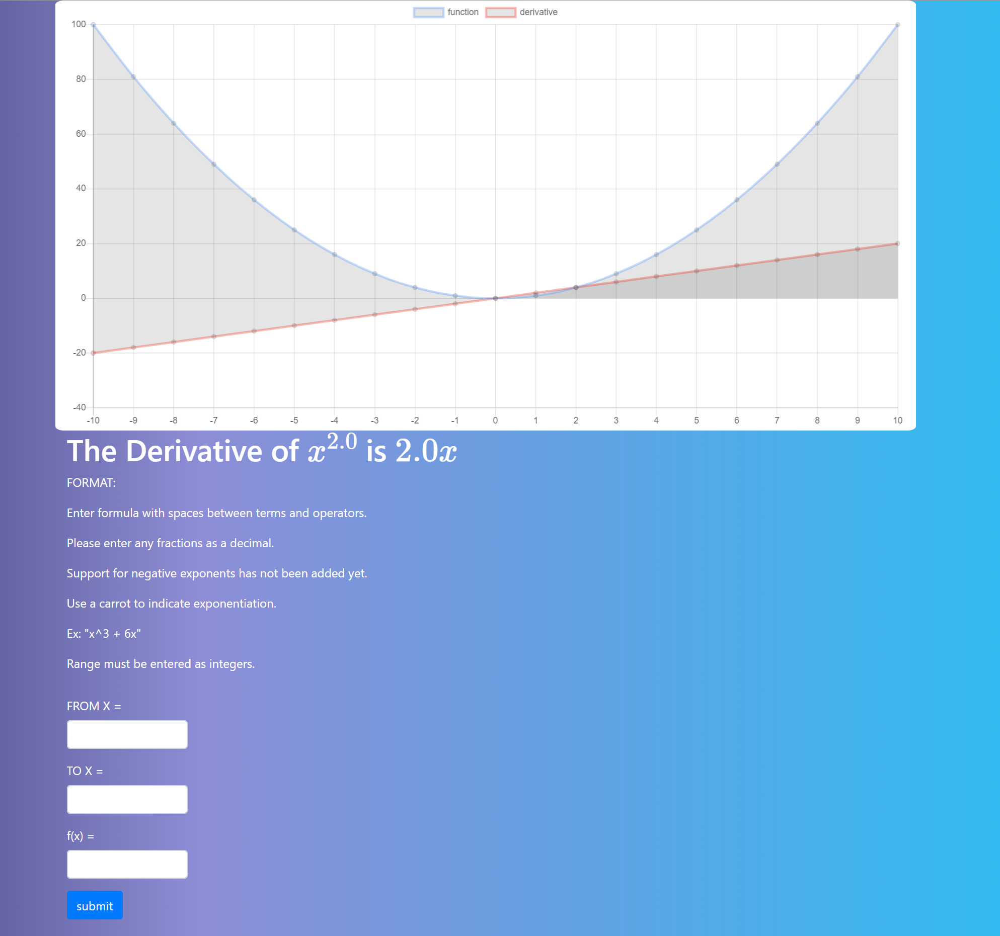

# Flask-Derivative-App
Simple web app for computing the derivative of a polynomial and graphing the results

# Flask-Derivative-App

A simple Flask app that calculates the derivative of a given polynomial and graphs both the original funciton and the derivative of it over a user-specified interval. The app is currently hosted with heroku and can be accessed at http://www.pythonderivative.com/ .

Side note: I am currently utilizing Heroku's free tier of hosting which means the VM instance the app is running on sleeps after 30 minutes of inactivity. As a result of this, when visiting the page, it make take a few seconds to load as the VM it is running on wakes up.

## Additional Libraries Used
- Chart.js was used to creat the graph and plot the functions

- MathJax was used to display LaTeX properly



### How to install and run locally

- Open CMD (or terminal on OSX/Linux) and navigate to a directory where you would like to save the project then clone the repo

- Navigate into the newly created folder "Flask-Derivative-App"

- Creating a python virtual environment is recommended here as it will not interfere with your current configuration of packages. 

- Install project specific packages with:
```
pip install -r requirements.txt
```
- To run the app on your local machine, enter:
```
py app.py
```
You will now be able to access the web app through your browser at http://127.0.0.1:5000/
